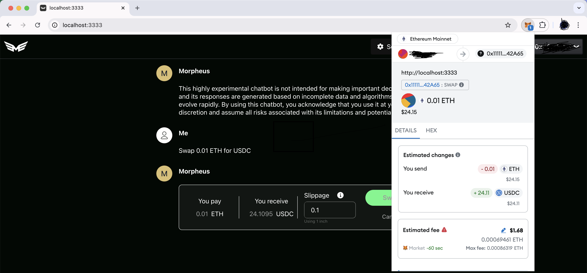

# MORagents

## Morpheus Install for Local Web3 Agent Interaction

---

### Features
#### Current: 
- Fetch price, market cap, and TVL of coins and tokens supported on CoinGecko
- Web interface (macOS only)
- Wallet integrations for your existing wallets in-browser (macOS only)
  - MetaMask
  - Rainbow
  - Coinbase Wallet
  - WalletConnect
- Web3 swap agents (macOS only)

#### Pending:
- Web interface (Windows)
- Wallet integrations for your existing wallets in-browser (Windows)
- Web3 swap agents (Windows)
- Chat with local files agent (general purpose)

---

### Install
#### macOS on M1/2/3 etc. (arm64)
>Assumes minimum 16GB RAM

#### Steps
1. Download and install [Docker Desktop](https://www.docker.com/products/docker-desktop/)
   1. Follow default settings, can skip surveys, then leave docker desktop running. You can minimize it.
2. Download [Moragents.zip](https://drive.proton.me/urls/X35VBE3GWW#mtrqT6rAzZbi), open ZIP, and copy MORagents.app to your Applications folder 
    > SHA256 96c2510e4f7a752c613b322be0a107958ee34814415e3e7b950b426298379a7a MORagents.zip
3. Open **MORagents** app. Give it a few minutes the first time, and then it should open your browser. 
   1. If there's an issue, try opening the MORagents app again

### macOS Intel (x86_64)
*coming soon*

---

### Windows (x86_64)
>Assumes minimum 16GB RAM

> Note the Windows version will be updated in the coming days to 0.0.8 (swap agent and price fetching).
> 
> Currently, the following is Windows MORagents 0.0.7 (price fetching only)

#### Steps
1. Download [MOR Agent Installer](https://drive.proton.me/urls/CN7HB67ZYM#OcQMLZO8oxC1)
    > SHA256 ae10e62852c2a26608c9d65a719c52e06f33a1c79ecc3ddaf82503910c41ef7c  MOR Agent Installer.zip
2. Go to downloaded **MOR Agent Installer(.zip)** file and click to "Extract All"
3. Open Extracted Folder **MOR Agent Installer**
4. Click and Run **MOR Agent Setup**
   1. This will auto-install Docker Desktop dependency
5. Open **MOR Agent** from Desktop
6. Accept Docker's EULA
   1. Surveys are optional, can skip
7. Wait for Docker engine to start...
8. Open **MOR Agent** App from Desktop
    1. First time install requires some extr time to load agent's image

#### Troubleshooting
If the app shows connections errors to agent fetcher. Please ensure Docker Desktop is running, then close and reopen **MOR Agent** from desktop.

---

#### Linux
*Coming soon*

---

### Build it Yourself

#### Build instructions:
1. [macOS](build_assets/macOS/README_MACOS_DEV_BUILD.md)
2. [Windows](build_assets/windows/README_WINDOWS_DEV_BUILD.md)
