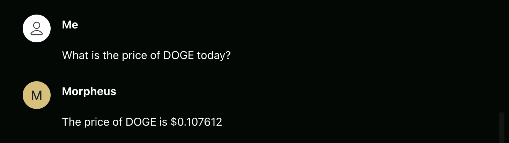
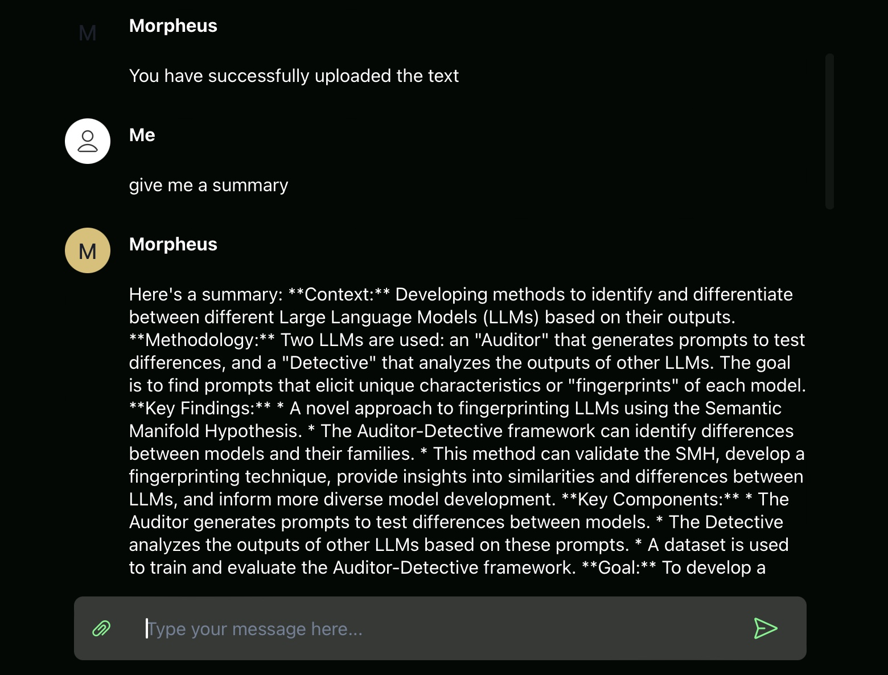

# MORagents

## Morpheus Install for Local Web3 Agent Interaction






---

### Features
#### Upload a PDF with paperclip icon, then ask questions about the PDF 📄
  - "Can you give me a summary?"
  - "What's the main point of the document?"
#### Swap ERC Compatible Tokens 🪙 -> 🪙
  - "Swap 0.01 ETH for USDC"
#### Fetch Price, Market Cap, and TVL of coins and tokens supported on CoinGecko 📈
  - "What's the price of ETH?"
  - "What's the market cap of BTC?"
#### Check MOR rewards 🏆
  - "How many MOR rewards do I have?"
#### Write Sizzling Tweets 🌶️ No Content Moderation 😅
  - "Write a based tweet about Crypto and AI"
  
**Works with your favorite wallet extensions in your existing browser**

---

## Install
### macOS
>Assumes minimum 16GB RAM

#### Steps to Install
1. Download Installer
   1. For Mac on Apple Silicon M1/2/3 etc. (arm64) 
      1. Download and run MORagents installer [MORagents010-apple.pkg](https://drive.proton.me/urls/G9JZYZ508R#gmDk0i6UFLSG)
      > SHA256 a4846c83ced5d35740f884a144cf518764edfc17b576b808cd77a8fe2da6ebf2 MORagents010-apple.pkg
   2. For Mac on Intel (x86_64)
      1. Download and install [Docker Desktop](https://desktop.docker.com/mac/main/amd64/Docker.dmg)
      2. Download and run MORagents installer [MORagents010-intel.pkg](https://drive.proton.me/urls/HPFMSN40GM#Pa90tgOzYn9g)
      > SHA256 46b0e927aaca27cf08d9a95b73d01bc07a92cb5a8b05cf69faaf71566712a781 MORagents010-intel.pkg
2. Wait several minutes for background files to download and then your browser should automatically open to http://localhost:3333
    > Note: After installation is complete, the MORagents app icon will bounce for several minutes on your dock, and then stop. This is normal behavior as it's downloading a couple large 9GB files in the background. You can open "Activity Monitor" and in the Network tab see that it's downloading.

#### Future Usage
- Open the "MORagents" app from Mac search bar.
  - For easier access: Right-click MORagents icon on dock -> Options -> Keep in Dock 

#### Troubleshooting
- If the app shows connections errors in connecting to agents. Please ensure Docker Desktop is running, then close and reopen **MORagents** from desktop.
- If installation is unsuccessful, run the following in your Terminal and open the MORagents....pkg again 
   ```shell
      $ xcode-select --install
   ```
---

### Windows (x86_64)
>Assumes minimum 16GB RAM

#### Steps
1. Download [MORagentsSetupWindows010.zip](https://drive.proton.me/urls/QXRZR77AJ0#U0ZRbd2rDbXT)
    > SHA256 0ca1879d3f103938a49852d2d2f82a36bc0ebc44ed94400fcee3b883e2cbb2f6 MORagentsSetupWindows010.zip
2. Go to downloaded **MORagentsSetupWindows010(.zip)** file and double click to open
3. Double click **MORagentsSetup.exe**
   1. You may need to click "More info" -> "Run anyway"
   2. If that still doesn't work, try temporarily disabling your antivirus and open the .exe again
4. Click and Run **MORagentsSetup.exe**
   1. This will auto-install Docker and Ollama dependencies. Those will ask you for confirmation.
5. Open **MORagents** from Desktop 
   1. Wait for Docker engine to start...
   2. If you see any errors or if anything hangs for >10min, please try opening the MORagents app again from the Desktop

#### Troubleshooting
If the app shows connections errors in connecting to agents. Please ensure Docker Desktop is running, then close and reopen **MORagents** from desktop.

---

#### Linux
*Coming soon*


---
# Adding a New Agent

See [Agents README](submodules/moragents_dockers/README.md) section: "Steps to Add a New Agent".

This will allow you to add custom agents which will be automatically invoked based on relevant user queries.

---

### Build it Yourself

#### Build instructions:
1. [macOS](build_assets/macOS/README_MACOS_DEV_BUILD.md)
2. [Windows](build_assets/windows/README_WINDOWS_DEV_BUILD.md)
