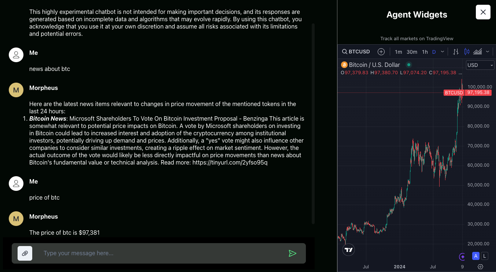

# MORagents

## Local Agents Built with the Friendliest of Dev Tooling
Python for AI Agents, JS for UI. Runs in your favorite browser. Made possible by Docker.
Fully Extensible! Add your own agents and have them automatically invoked based on user intent.





---

### Features
#### Write Sizzling Tweets 🌶️ No Content Moderation 😅
  - "Write a based tweet about Crypto and AI"
#### Real-time Info 🕸️
  - "Real-time info about Company XYZ"
#### Trending Crypto News
  - "Latest news for USDC"
#### Check MOR rewards 🏆
  - "How many MOR rewards do I have?"
#### Fetch Price, Market Cap, and TVL of coins and tokens supported on CoinGecko 📈
  - "What's the price of ETH?"
  - "What's the market cap of BTC?"
#### Upload a PDF with paperclip icon, then ask questions about the PDF 📄
  - "Can you give me a summary?"
  - "What's the main point of the document?"

---

## Easy Install
### macOS
>Assumes minimum 16GB RAM

#### Steps to Install
1. Download Installer
   1. For Mac on Apple Silicon M1/2/3 etc. (arm64) 
      1. Download and run MORagents installer [MORagents020-apple.pkg](https://drive.proton.me/urls/20ENWS94AW#Kols2sA9mWLf)
      > SHA256 e65e11719a24ca9a00545443a35cda3b6d78f756b8e2ba535db00399ef75168f MORagents020-apple.pkg
   2. For Mac on Intel (x86_64)
      1. Download and run MORagents installer [MORagents020-intel.pkg](https://drive.proton.me/urls/1SFGC83RMR#7hdNk4t7bQ0y)
      > SHA256 0e3a831f9817ff8fe79cc87d87a60a7884e6752becde20aaa1920133ab2d8036 MORagents020-intel.pkg
2. Wait several minutes for background files to download and then your browser should automatically open to http://localhost:3333
    > Note: After installation is complete, the MORagents app icon will bounce for several minutes on your dock, and then stop. This is normal behavior as it's downloading a <7GB of files in the background. You can open "Activity Monitor" and in the Network tab see that it's downloading.

#### Future Usage
- Open the "MORagents" app from Mac search bar.
  - For easier access: Right-click MORagents icon on dock -> Options -> Keep in Dock 

#### Troubleshooting
- If the app shows connections errors in connecting to agents. Please ensure Docker Desktop is running, then close and reopen **MORagents** from desktop.
- If installation is unsuccessful, run the following in your Terminal and open the MORagents....pkg again 
   ```shell
      $ xcode-select --install
   ```
---

### Windows (x86_64)
>Assumes minimum 16GB RAM

#### Steps
1. Download [MORagentsSetupWindows020.zip](https://drive.proton.me/urls/CV5NDK88W8#TNGSOxKUbq4b)
    > SHA256 1802a941517ad19c732d3a34bfd353fd9a7eb5921ca12210dc5335cf75e34ee8 MORagentsSetupWindows020.zip
2. Go to downloaded **MORagentsSetupWindows020(.zip)** file and double click to open
3. Double click **MORagentsSetup.exe**
   1. You may need to click "More info" -> "Run anyway"
   2. If that still doesn't work, try temporarily disabling your antivirus and open the .exe again
4. Click and Run **MORagentsSetup.exe**
   1. This will auto-install Docker and Ollama dependencies. Those will ask you for confirmation.
5. Open **MORagents** from Desktop 
   1. Wait for Docker engine to start...
   2. If you see any errors or if anything hangs for >10min, please try opening the MORagents app again from the Desktop

#### Troubleshooting
If the app shows connections errors in connecting to agents. Please ensure Docker Desktop is running, then close and reopen **MORagents** from desktop.

---

#### Linux
*Coming soon*

---
# Adding a New Agent

See [Agents README](submodules/moragents_dockers/README.md) section: "Steps to Add a New Agent".

This will allow you to add custom agents which will be automatically invoked based on relevant user queries.

---

### Build it Yourself

#### Build instructions:
1. [macOS](build_assets/macOS/README_MACOS_DEV_BUILD.md)
2. [Windows](build_assets/windows/README_WINDOWS_DEV_BUILD.md)
 