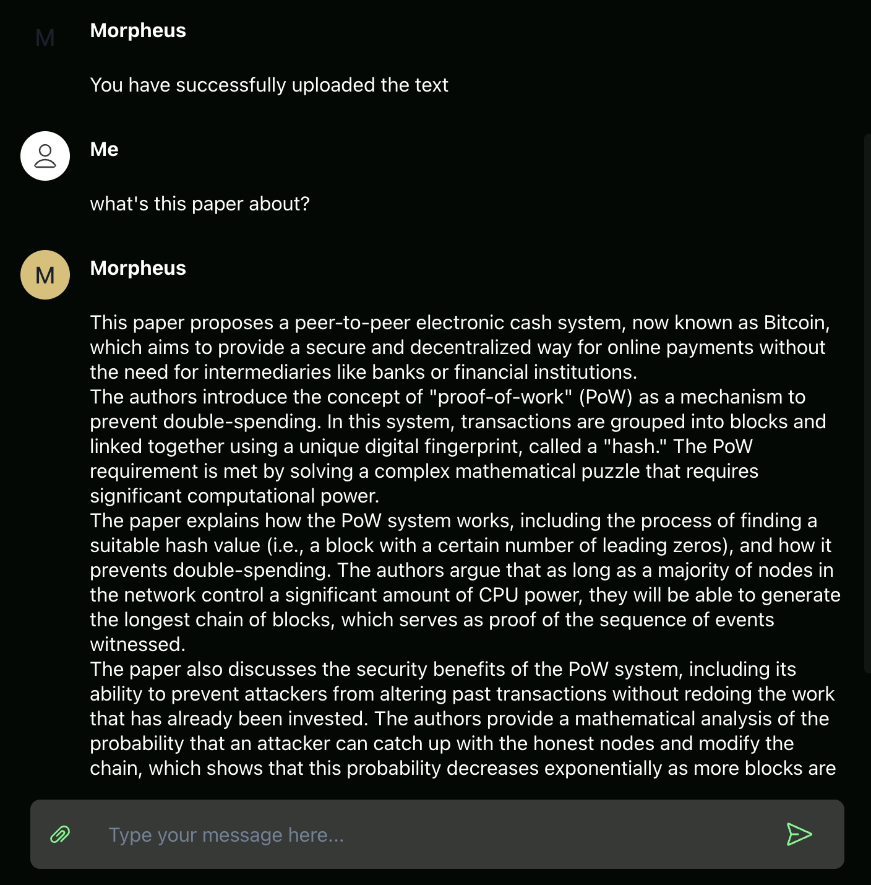

# MORagents

## Morpheus Install for Local Web3 Agent Interaction

---

### Features
- Chat with local PDF files
- Swap ERC Compatible Tokens
- Fetch Price, Market Cap, and TVL of coins and tokens supported on CoinGecko
- Web interface works in your preferred browser:
  - Chrome
  - Brave 
  
  with your favorite wallet extensions:
    - MetaMask
    - Rainbow
    - Coinbase Wallet
    - WalletConnect

---

## Install
### macOS on M1/2/3 etc. (arm64)
>Assumes minimum 16GB RAM

#### Steps to Install
1. Download and install [Docker Desktop](https://www.docker.com/products/docker-desktop/)
   1. Follow default settings, can skip surveys, then leave docker desktop running. You can minimize it.
2. Download and install [MORagents009.pkg](https://drive.proton.me/urls/762Z6QFNH4#68MKubcGeDtf) 
    > SHA256 5200350bba351a40cfac5552476bad1bb67d32ff069a4d9ebc0b3556367673b7  MORagents009.pkg
3. Wait several minutes for background files to download and then your browser should automatically open to http://localhost:3333
    > Note: After installation is complete, the MORagents app icon will bounce for several minutes on your dock, and then stop. This is normal behavior as it's downloading a large 9GB file in the background. You can open "Activity Monitor" and in the Network tab see that it's downloading.

#### Future Usage
- Open the "MORagents" app from Mac search bar.
  - For easier access: Right-click MORagents icon on dock -> Options -> Keep in Dock 

#### Troubleshooting
If the app shows connections errors in connecting to agents. Please ensure Docker Desktop is running, then close and reopen **MORagents** from desktop.

### macOS Intel (x86_64)
*coming soon*

---

### Windows (x86_64)
>Assumes minimum 16GB RAM

#### Steps
1. Use Chrome to download [MORagentsSetupWindows009.zip](https://drive.proton.me/urls/8X58WAH80G#ib5r3K4WalDA)
    > SHA256 6b8bd78571df2f5e8c6e516102aa05b1121d0214fdfb75a2be16146c22e0d2c52 MORagentsSetupWindows009.zip
2. Go to downloaded **MORagentsSetupWindows009(.zip)** file and double click to open
3. Double click **MORagentsSetup.exe**
   1. You may need to click "More info" -> "Run anyway"
   2. If that still doesn't work, try temporarily disabling your antivirus and open the .exe again
4. Click and Run **MORagentsSetup.exe**
   1. This will auto-install Docker and Ollama dependencies. Those will ask you for confirmation.
5. Open **MORagents** from Desktop 
   1. Wait for Docker engine to start...
   2. If you see any errors or if anything hangs for >10min, please try opening the MORagents app again from the Desktop

#### Troubleshooting
If the app shows connections errors in connecting to agents. Please ensure Docker Desktop is running, then close and reopen **MORagents** from desktop.

---

#### Linux
*Coming soon*

---

### Build it Yourself

#### Build instructions:
1. [macOS](build_assets/macOS/README_MACOS_DEV_BUILD.md)
2. [Windows](build_assets/windows/README_WINDOWS_DEV_BUILD.md)
