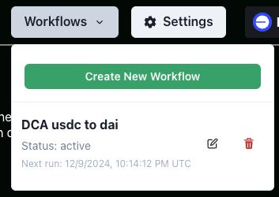

# Introduction to the Coinbase Enabled Agent Experience
Welcome to the new world of the Coinbase enabled agent experience. This guide will walk you through the process of setting up your Coinbase API configuration and using the available features.

## Setting Up Coinbase API Configuration
To get started, you'll need to create your Coinbase developer platform API key and API secret by visiting your Coinbase developer portal. Once you have your API key and API secret, follow these steps:
1. Spin up the MORagents application
2. Click **Settings** at the top
3. Click **Coinbase API**
4. Paste your API key and API secret
5. Click **Save Coinbase Credentials** to lock these values in

## Creating a Coinbase Wallet
Note that the wallet you use to perform dollar cost averaging and gasless sends is separate from your browser wallet integration. To create your Coinbase wallet:
1. Click **CDP Wallets** at the top of the UI for MORagents
2. Click **Create New Wallet**
This will create a new local wallet file. Please download this file and store it somewhere safe, as subsequent openings of the MORagents app may not restore it automatically.

## Restoring Your Coinbase Wallet
To restore your wallet, follow these steps:
1. Click **CDP Wallets**
2. Click **Create New Wallet**
3. Click **Restore Existing**
4. Choose the JSON file you downloaded earlier
It's imperative that you have the JSON file somewhere secure, as future openings of this app may not necessarily restore it, and not doing so may result in a loss of funds.

### To fund your wallet:
1. Click **CDP Wallets** at the top
2. Click the copy icon to retrieve the address of your Coinbase local wallet
3. Use MetaMask or any other wallet set to the base L2 to send USDC to this address
Once your wallet is funded, you can ask the agent, "what is my USDC balance on base?" to see the updated balance. To send USDC from this agent to another address, type "send USDC on base" and follow the prompts.

### Dollar Cost Averaging (DCA) Swaps
The DCA agent allows you to set up a recurring workflow to swap from one currency to another, such as from USDC to DAI. To use this feature:
1. Fund your wallet with ETH on the base L2 (you can send ETH to this wallet the same way you sent USDC earlier)
2. Say "set up a DCA strategy" to the agent
3. Specify the frequency, amount, and maximum spend level in the widget that opens
Note that your app needs to be running for the executions to occur at the specified time.
4. You can verify your DCA strategies by clicking "Workflows" at the top

## Community Development
All agents, including the Gasless Send and DCA agents are provided under the MIT license for the community to build and explore. They are references for the community to build and eventually ship to the decentralized inference of Morpheus in early 2025, where these agents can live and function for long periods of time without needing local compute.