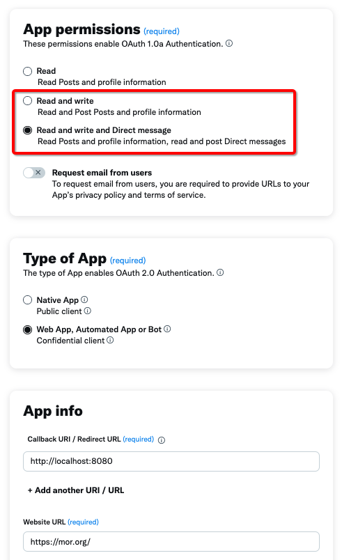
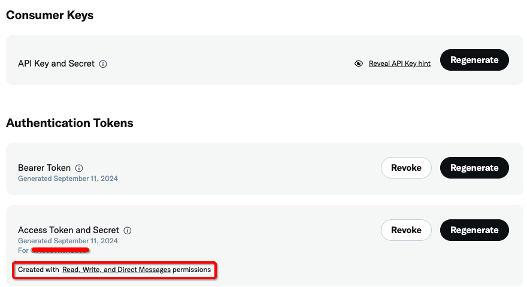

# Tweet Sizzler Agent

This agent enables you to generate and post tweets using AI. It should be used with the accompanying UI, which provides a browser-based front-end to chat with the agent, display generated tweets, and post them to X (formerly Twitter).

A typical flow looks like this:

- User prompts for a tweet, e.g., "Generate a tweet about AI in healthcare"
- The agent generates a tweet which is shown to the user, who may either proceed to post it or request a new generation
- If the user accepts the tweet, it can be posted to X (Twitter)

## Table of Contents

- [Installation](#installation)
- [Initial Setup for Integration with X Developer API](#initial-setup-for-integration-with-x-developer-api)
- [Usage](#usage)

## Installation

## Run with Docker Compose

Docker compose will build and run two containers. One will be for the agents, the other will be for the UI.

1. Ensure you're in the submodules/moragents_dockers folder

   ```sh
   $ cd submodules/moragents_dockers
   ```

2. Build Images and Launch Containers:
   1. For Intel / AMD / x86_64
      ```sh
      docker-compose up
      ```
   2. For Apple silicon (M1, M2, M3, etc)
      ```sh
      docker-compose -f docker-compose-apple.yml up
      ```

Open in the browser: `http://localhost:3333/`

## Initial Setup for Integration with X Developer API

To use the Tweet Sizzler Agent, you need to set up a developer account and create an application on the X Developer Portal. Follow these steps:

1. Sign into the X/Twitter Developer Portal at https://developer.twitter.com/en/portal/dashboard and create a developer account if you haven't already.

2. Create a new project. This will automatically generate a set of consumer keys and authentication tokens for you. Do not use these because the auto-generated set of access tokens and secrets will not have the appropriate permissions. You should notice the text "Created with Read permissions". For the Tweet Sizzler, we need Write permissions.

3. To set up Write permissions:

   - Go to the Settings tab of your project
   - Find the "User authentication settings" section and click into it
   - Under "App permissions (required)", select either "Read and write" or "Read, write, and direct messages"
   - For "Type of App", select "Web App, Automated App or Bot"
   - For the Callback URI, you can use `http://localhost:5000/callback`
   - For the Website URL, use any valid website URL (not localhost)
   - Click Save to persist these settings


_Figure 2: X Developer Portal User Authentication Settings_

Note: Your setup for the user authentication settings should look something like this. Make sure you have selected either "Read and write" or "Read and write and Direct message" under the app permissions section. This configuration is crucial for the Tweet Sizzler agent to function properly and post tweets on your behalf.

4. Return to the Keys and Tokens tab. You'll notice the Access Token and Secret still say "Created with Read permissions". Click the "Regenerate" button to create a new access token / secret pair with the permissions we set up in step 3.

5. Double-check that the Access Token and Secret contain a subtitle saying "Created with Read, Write, and Direct Messages permissions".

6. Enter the consumer keys and authentication tokens from this page into the settings modal of the Morpheus app.


_Figure 1: X Developer Portal Dashboard_

Note: For the Tweet Sizzler agent to work correctly, you need to ensure that your app permissions are set to "Read and write" or "Read, write, and Direct Messages" as shown in the image above. This level of permission is necessary for the agent to post tweets on your behalf.
